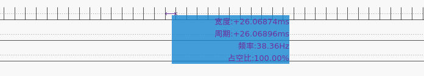

# _HMI_

FPS: 38 Hz



## How to use

* Compile and download

Please unplug the camera module before downloading the code!!!

```bash
idf.py set-target esp32s2
./components/esp_lua_lib/tools/lua_flash.sh
1
1
```